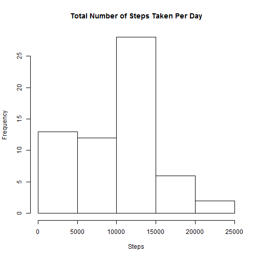
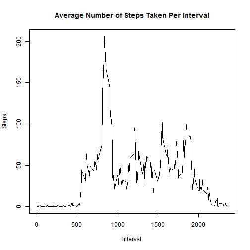
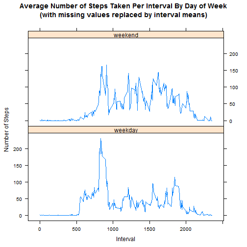

## Loading and preprocessing the data

```r
# set working directory
path_wd = "C:\\Users\\Frank\\Dropbox\\Coursera\\Reproducible_Research\\RepData_PeerAssessment1"
setwd(path_wd)

# load required packages
library(dplyr)
library(lubridate)
library(sqldf)
library(lattice)
################################################################################

# download and extract datasets

# download raw data (no need, already in forked repo)
# fileurl <- "https://d396qusza40orc.cloudfront.net/repdata%2Fdata%2Factivity.zip"
# download.file(fileurl, "repdata_data_activity")
# dateDownloaded <- date()

# unzip downloaded data
unzip("activity.zip")
# list.files("./")  
################################################################################

# read in and format dataset

data <- read.csv("activity.csv", stringsAsFactors = FALSE)
data <- tbl_df(data)
data <- mutate(data, date = ymd(date))
```
  
## What is mean total number of steps taken per day?

```r
# 1. Calculate the total number of steps taken per day
data <- group_by(data, date)
total_steps_day <- summarise(data, total_steps_day = sum(steps, na.rm = TRUE))

# 2. Make a histogram of the total number of steps taken each day
hist(total_steps_day$total_steps_day, main = "Total Number of Steps Taken Per Day", 
     xlab = "Steps")
```

 

```r
# 3. Calculate and report the mean and median of the total number of steps taken per day
mean_total_steps_day = summarise(total_steps_day, mean(total_steps_day, na.rm = TRUE))
median_total_steps_day = summarise(total_steps_day, median(total_steps_day, na.rm = TRUE))
```
  
The **MEAN** total number of steps taken per day is approx. **9354.23**  
The **MEDIAN** total number of steps taken per day is **10395**  
  
## What is the average daily activity pattern?

```r
# 1. Make a time series plot (i.e. type = "l") of the 5-minute interval (x-axis) 
# and the average number of steps taken, averaged across all days (y-axis)

data <- group_by(data, interval)
mean_steps_interval <- summarise(data, mean_steps_interval = mean(steps, na.rm = TRUE))

plot(mean_steps_interval$interval, mean_steps_interval$mean_steps_interval, type = "l", 
     main = "Average Number of Steps Taken Per Interval", xlab = "Interval",  
     ylab = "Steps")
```

 

```r
# 2. Which 5-minute interval, on average across all the days in the dataset, 
# contains the maximum number of steps?
max_mean_steps_interval <- sqldf("select interval, max(mean_steps_interval) as 
                            max_mean_steps_interval from mean_steps_interval") 
```
The interval with the **MAXIMUM AVERAGE** number of steps per day is **835** with approx. **206.17** steps  
  
## Imputing missing values

```r
# 1. Calculate and report the total number of missing values in the dataset 
# (i.e. the total number of rows with NAs)

data_NA <- filter(data, is.na(steps))
```
  
**2304** records are missing values (steps) in the dataset  
  

```r
# 2. Devise a strategy for filling in all of the missing values in the dataset. 

# substitute mean value of matching 5 minute interval for NA values
data_NA_join_mean_int <- left_join(data_NA, mean_steps_interval, "interval")
data_NA_filled <- mutate(data_NA_join_mean_int, steps = mean_steps_interval)
data_NA_filled <- sqldf("select steps, date, interval from data_NA_filled") 

rm(data_NA)
rm(data_NA_join_mean_int)

# 3. Create a new dataset that is equal to the original dataset but with the missing data filled in.
data_complete <- filter(data, !is.na(steps))
data_filled <- rbind(data_complete, data_NA_filled)

rm(data_complete)
rm(data_NA_filled)

# 4. Make a histogram of the total number of steps taken each day and Calculate 
# and report the mean and median total number of steps taken per day. 
# Do these values differ from the estimates from the first part of the assignment? 
# What is the impact of imputing missing data on the estimates of the total daily number of steps?

# histogram of the total number of steps taken each day 
data_filled <- group_by(data_filled, date)
total_steps_day_filled <- summarise(data_filled, total_steps_day = sum(steps))
hist(total_steps_day_filled$total_steps_day, 
     main = "Total Number of Steps Taken Each Day\n(with missing values replaced by interval means)", 
           xlab = "Steps")
```

 

```r
# mean and median total number of steps taken per day
mean_total_steps_day_filled <- summarise(total_steps_day_filled, 
                                         mean_total_steps_day = mean(total_steps_day))
median_total_steps_day_filled <- summarise(total_steps_day_filled, 
                                         median_total_steps_day = median(total_steps_day))
```
  
The **MEAN** total number of steps taken per day (with imputed data) is approx. 
**10766.19**  
The **MEDIAN** total number of steps taken per day (with imputed data) is approx. 
**10766.19**  
  
Imputing missing data replaced a number of the zero values, shifted the distribution of total steps per day to the right and made it more normal. The mean and median values have both increased and are almost identical.  
  
## Are there differences in activity patterns between weekdays and weekends?

```r
# 1. Create a new factor variable in the dataset with two levels - # "weekday" 
# and "weekend" indicating whether a given date is a weekday or weekend day.
data_filled <- ungroup(data_filled)
data_filled <- mutate(data_filled, 
                      week = ifelse(weekdays(data_filled$date) == "Saturday"|
                                    weekdays(data_filled$date) == "Sunday", 
                                    "weekend", "weekday"))
data_filled <- mutate(data_filled, week = as.factor(week))

# 2. Make a panel plot containing a time series plot (i.e. type = "l") of the 
# 5-minute interval (x-axis) and the average number of steps taken, averaged 
# across all weekday days or weekend days (y-axis). 

data_filled <- group_by(data_filled, week, interval)
mean_steps_interval_filled <- summarise(data_filled, mean_steps_interval = mean(steps))

## Plot with lattice
xyplot(mean_steps_interval ~ interval | week, mean_steps_interval_filled, type = "l",
       main = "Average Number of Steps Taken Per Interval By Day of Week\n(with missing values replaced by interval means)",
       xlab = "Interval", ylab = "Number of Steps", layout = c(1, 2))
```

 
  
Yes there appear to be differences in the activity patterns. This person appears to be most active in the morning on weekdays and is more consistently active throughout the day on weekends.  
  
